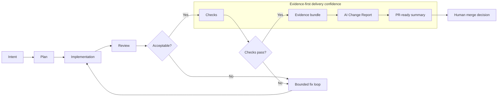
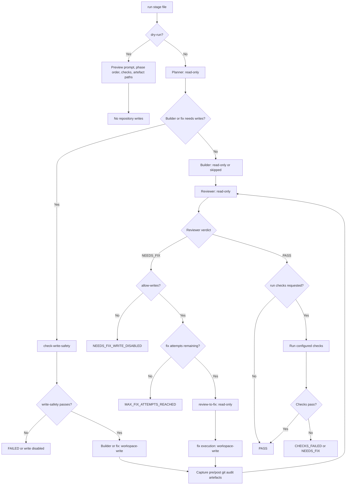
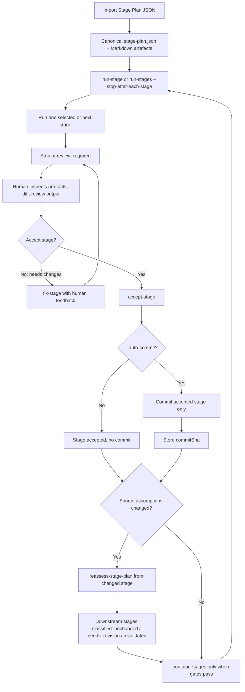
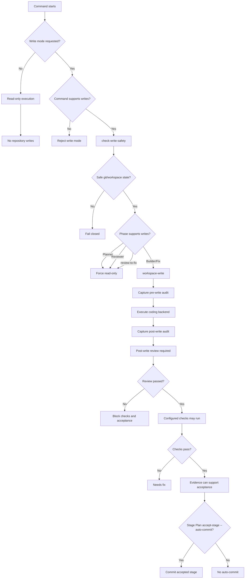
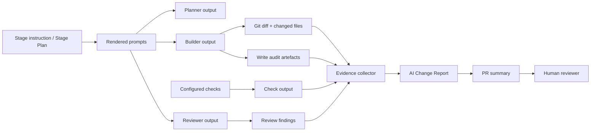

# MergeWright flows

This page shows the main delivery flows in MergeWright.

MergeWright sits above coding agents and turns agent-generated work into reviewable, auditable, merge-ready software changes. These diagrams should be read as product flow diagrams, not implementation call graphs.

## Delivery confidence flow

This is the core product path from intent to PR-ready evidence.

## Classic run and auto-chain flow

Use this flow for a single stage file executed through planner, builder, reviewer, optional fix attempts, checks, and report generation.

## Stage Plan workflow

Use this flow for human-gated multi-stage delivery. Each stage is run, reviewed, fixed or accepted, and then downstream stages can be reassessed before continuing.

## Write-safety and gate model

Write execution is explicit. Planner, reviewer, and reassessment-style phases stay read-only even when writes are enabled.

## Artefacts and AI Change Report flow

Reports are built from delivery evidence. They should not overclaim when required evidence is absent.

