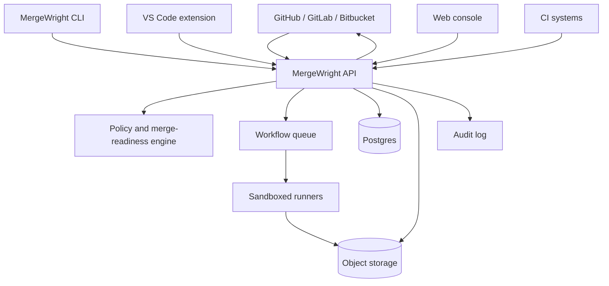

# MergeWright Enterprise Roadmap

Status: Proposed  
Scope: Productisation roadmap for moving MergeWright from a local AI delivery harness into an enterprise-grade daily-use engineering platform.  
Recommended location: `docs/plans/enterprise-roadmap.md`

## Strategic position

MergeWright should not try to become another general-purpose coding agent. Its strongest position is:

> Evidence-first merge governance for AI-assisted engineering teams.

The product should help teams answer:

> Should this AI-assisted change be trusted to merge, and why?

This roadmap is built around that position. It keeps the current CLI and staged workflow as the foundation, then adds the product layers needed for team adoption, hosted operation, enterprise controls, and daily developer workflow integration.

## North-star outcomes

By the end of this roadmap, MergeWright should provide:

1. A reliable local CLI for staged AI delivery workflows.
2. A GitHub-native review and merge-readiness layer.
3. Durable evidence packs for every AI-assisted change.
4. Policy-as-code for merge readiness and review gates.
5. A web console for teams to inspect runs, evidence, failures, and approvals.
6. Secure, isolated execution runners.
7. Enterprise controls: SSO, RBAC, audit logs, tenant isolation, hosted and self-hosted deployment options.
8. IDE and chat integrations that make MergeWright part of daily engineering flow.

## Roadmap overview

| Stage | Theme | Primary goal | Outcome |
|---|---|---|---|
| 0 | Foundation cleanup | Make the repo credible, installable, and internally consistent | Public-ready project baseline |
| 1 | Core engine hardening | Formalise staged execution, evidence, policy, and backend contracts | Stable local engine |
| 2 | GitHub-native adoption | Surface MergeWright directly in pull requests | First daily-use workflow |
| 3 | Durable evidence platform | Add API, storage, immutable run records, and evidence retrieval | Team-scale trust layer |
| 4 | Web console | Give teams a visual control plane for runs and merge readiness | Operational visibility |
| 5 | Secure enterprise execution | Add secure runners, secrets isolation, SSO, RBAC, and audit logs | Enterprise readiness |
| 6 | Workflow intelligence | Add conflict prediction, queue awareness, impact analysis, and analytics | Differentiated platform value |
| 7 | Ecosystem and commercialisation | Add integrations, packaging, deployment modes, and marketplace readiness | Enterprise product motion |

---

# Stage 0: Foundation cleanup

## High-level objective

Make MergeWright look and behave like a serious open-source project that engineers can install, understand, and trust.

## Mid-level workstreams

### 0.1 Branding and documentation consistency

Low-level tasks:

- Replace stale Shepherds-Staff or Shephards-Staff references with MergeWright.
- Ensure README, package metadata, docs-site, examples, and GitHub description match.
- Add a concise product positioning statement:
  - “MergeWright turns AI coding work into reviewable, auditable, merge-ready software changes.”
- Add a clear “What this is / What this is not” section:
  - Is: AI delivery harness, evidence collector, merge-readiness gate.
  - Is not: coding agent, IDE replacement, merge queue replacement.

Acceptance criteria:

- No stale product-name references remain outside migration notes.
- README and docs-site use the same terminology.
- New users can understand the product in under five minutes.

### 0.2 Release readiness

Low-level tasks:

- Remove `private: true` from `package.json` when ready to publish.
- Define semantic versioning policy.
- Add `CHANGELOG.md`.
- Add release checklist.
- Add npm packaging dry-run validation.
- Add GitHub release workflow.
- Add binary or CLI install guidance.

Acceptance criteria:

- `npm pack --dry-run` produces expected files only.
- Release notes can be generated for each version.
- Installation instructions work on a clean machine.

### 0.3 Repository trust baseline

Low-level tasks:

- Add `CONTRIBUTING.md`.
- Add `SECURITY.md`.
- Add `CODE_OF_CONDUCT.md`.
- Add issue templates:
  - Bug report
  - Feature request
  - Design proposal
  - Backend adapter request
- Add PR template with:
  - Summary
  - Evidence
  - Tests
  - Safety impact
  - Docs impact
- Add architecture decision record directory:
  - `docs/adr/`

Acceptance criteria:

- Repo is ready for outside contributors.
- Security reporting path is clear.
- PRs force evidence-first review habits.

---

# Stage 1: Core engine hardening

## High-level objective

Turn the current local engine into a stable, well-tested foundation that can support hosted and enterprise workflows later.

## Mid-level workstreams

### 1.1 Execution backend contract

Low-level tasks:

- Define a stable `AgentExecutor` interface.
- Define generic request/result types:
  - `AgentExecutorRequest`
  - `AgentExecutorResult`
  - `AgentExecutorCapabilities`
  - `AgentExecutorFailure`
- Move backend-specific Codex and OpenCode logic behind adapters.
- Add backend capability negotiation:
  - supports streaming
  - supports sandbox mode
  - supports read-only mode
  - supports model selection
  - supports output artefacts
  - supports structured JSON output
- Add fixture tests for each backend adapter.

Acceptance criteria:

- Planner, builder, reviewer, fixer, and reassessor use the generic executor interface.
- No orchestration layer imports backend-specific implementation details.
- Backend capability mismatches fail before execution.

### 1.2 Evidence manifest v1

Low-level tasks:

- Define a versioned evidence manifest schema:
  - run ID
  - stage ID
  - git base SHA
  - git head SHA
  - changed files
  - commands run
  - test outputs
  - reviewer output
  - write audit
  - policy result
  - artefact file paths
  - timestamps
- Store manifest per run.
- Add schema validation.
- Add golden snapshot tests.
- Add docs explaining each field.

Acceptance criteria:

- Every run has a machine-readable manifest.
- Missing required evidence fails merge-readiness evaluation.
- Manifest format is versioned and migration-ready.

### 1.3 Merge-readiness policy engine

Low-level tasks:

- Extract merge-readiness rules from CLI flow into a pure domain module.
- Add policy inputs:
  - acceptance criteria
  - required checks
  - allowed touched files
  - blocked file patterns
  - required reviewer pass
  - required test evidence
  - max fix attempts
  - dirty git state rules
- Add policy outputs:
  - pass/fail
  - blocking reasons
  - warning reasons
  - required next action
- Support policy configuration in project config.
- Add deterministic tests for every policy branch.

Acceptance criteria:

- Policy evaluation is deterministic and testable without running Codex.
- Policy output can be rendered in CLI, PR comment, API, and UI.
- Failing checks explain exactly what evidence is missing.

### 1.4 Stage plan lifecycle hardening

Low-level tasks:

- Formalise stage states:
  - proposed
  - queued
  - running
  - blocked
  - needs-review
  - accepted
  - failed
  - superseded
- Add transition rules.
- Add transition validation tests.
- Add recovery behaviour for interrupted runs.
- Add idempotent `continue-run` semantics.

Acceptance criteria:

- Invalid transitions fail with actionable messages.
- Interrupted runs can be resumed safely.
- State transitions are recorded in evidence.

### 1.5 CLI UX polish

Low-level tasks:

- Add `mergewright doctor`.
- Add `mergewright init`.
- Add `mergewright status`.
- Add `mergewright explain <run-id>`.
- Add clear dry-run output for stage plans.
- Add concise error messages with next action.

Acceptance criteria:

- New users can initialise and run a local workflow without reading internals.
- Common setup failures are detected by `doctor`.
- Error output is actionable.

---

# Stage 2: GitHub-native adoption

## High-level objective

Make MergeWright useful where teams already review and merge code: pull requests.

## Mid-level workstreams

### 2.1 GitHub App MVP

Low-level tasks:

- Create GitHub App.
- Implement webhook receiver for:
  - pull request opened
  - pull request synchronised
  - pull request reopened
  - check suite requested
  - issue comment command
- Add app installation flow.
- Store installation metadata.
- Map GitHub repo and PR to MergeWright run context.
- Add local dev webhook setup documentation.

Acceptance criteria:

- Installing the app enables MergeWright checks on selected repositories.
- A PR event can trigger a read-only assessment.
- Webhook payloads are validated and safely rejected when invalid.

### 2.2 PR status checks

Low-level tasks:

- Publish check run:
  - MergeWright Readiness
  - Evidence Complete
  - Reviewer Gate
  - Test Evidence
- Map policy result to check conclusion.
- Link each check to evidence artefact.
- Show blocking reasons in check summary.
- Make check names stable for branch protection.

Acceptance criteria:

- Teams can make MergeWright checks required in GitHub branch protection.
- Check output explains failure without opening local artefacts.
- Check output never claims success without required evidence.

### 2.3 PR comment summary

Low-level tasks:

- Generate PR summary:
  - What changed
  - What was tested
  - What evidence exists
  - Reviewer verdict
  - Risks
  - Required human action
- Update existing bot comment instead of spamming new comments.
- Add “rerun”, “continue”, and “explain” comment commands.
- Add markdown rendering tests.

Acceptance criteria:

- PR reviewers can understand MergeWright’s result inside GitHub.
- Repeated runs update the same comment.
- Bot commands are permission-checked.

### 2.4 GitHub Actions integration

Low-level tasks:

- Add GitHub Action:
  - `mergewright/assess`
  - `mergewright/report`
  - `mergewright/evidence-upload`
- Support local CLI plus GitHub Action mode.
- Allow evidence artefacts to be uploaded from CI.
- Add sample workflow files.

Acceptance criteria:

- Teams can adopt without installing hosted runners first.
- Existing CI can feed test evidence into MergeWright.
- Example workflow works in a sample repo.

---

# Stage 3: Durable evidence platform

## High-level objective

Move from local-only artefacts to durable, queryable, team-visible evidence records.

## Mid-level workstreams

### 3.1 API service

Low-level tasks:

- Create API service package.
- Add routes:
  - create run
  - read run
  - list runs
  - create stage event
  - upload evidence
  - evaluate policy
  - read policy result
  - read PR summary
- Add OpenAPI spec.
- Add request validation.
- Add API integration tests.

Acceptance criteria:

- CLI and GitHub App can both use the same API.
- API responses are stable and documented.
- Invalid requests fail with structured errors.

### 3.2 Data model

Low-level tasks:

- Add Postgres schema:
  - organisations
  - users
  - repositories
  - installations
  - runs
  - stages
  - stage events
  - evidence manifests
  - policy evaluations
  - approvals
  - audit events
- Add migrations.
- Add seed data for local dev.
- Add repository layer tests.

Acceptance criteria:

- Runs are queryable by repo, PR, SHA, branch, and status.
- Stage history is immutable.
- Policy evaluations are stored with their input version.

### 3.3 Artefact storage

Low-level tasks:

- Add S3-compatible storage abstraction.
- Store:
  - raw logs
  - diffs
  - test output
  - write audit
  - AI outputs
  - rendered reports
- Add checksum validation.
- Add signed URL retrieval.
- Add retention policy config.

Acceptance criteria:

- Evidence can be retrieved after local run directory is gone.
- Artefacts are tamper-evident.
- Retention can be configured per organisation.

### 3.4 Immutable evidence packs

Low-level tasks:

- Add `mergewright evidence pack <run-id>`.
- Generate portable ZIP or tar archive.
- Include manifest, artefacts, checksums, policy result, and summary.
- Add verification command:
  - `mergewright evidence verify <pack>`
- Add tests for pack verification.

Acceptance criteria:

- Evidence packs can be exported for audits.
- Verification fails if content was modified.
- Pack format is documented.

---

# Stage 4: Web console

## High-level objective

Give teams a visual control plane for inspecting runs, approvals, policy failures, and evidence.

## Mid-level workstreams

### 4.1 Run timeline

Low-level tasks:

- Build web app shell.
- Add run list.
- Add run detail page.
- Show timeline:
  - plan created
  - builder started
  - files changed
  - tests run
  - reviewer completed
  - fix loop started
  - policy evaluated
  - human accepted
- Show links to PR, commit, and artefacts.

Acceptance criteria:

- A developer can inspect a run without using local files.
- Timeline accurately reflects immutable stage events.
- Failed states show next action.

### 4.2 Evidence viewer

Low-level tasks:

- Add tabs for:
  - summary
  - diff
  - test evidence
  - reviewer output
  - write audit
  - policy result
  - raw artefacts
- Add filtering for blocking findings.
- Add copyable evidence links.
- Add syntax highlighting for diffs and logs.

Acceptance criteria:

- Reviewers can inspect the evidence needed to approve or reject a run.
- Evidence is readable without downloading a full pack.
- Missing evidence is clearly shown.

### 4.3 Approval workflow

Low-level tasks:

- Add approve/reject/reassess controls.
- Add required reason on rejection.
- Add approval history.
- Add role checks for approval actions.
- Add PR check update after approval state changes.

Acceptance criteria:

- Human approval is captured as evidence.
- Approval state cannot be forged by client-side actions.
- PR status updates after approval.

### 4.4 Team dashboard

Low-level tasks:

- Add dashboard metrics:
  - runs by status
  - failed policy reasons
  - average fix loops
  - flaky checks
  - top conflict-prone files
  - time from run start to merge-ready
- Add repository filter.
- Add date range filter.
- Add export CSV.

Acceptance criteria:

- Engineering leads can see where AI-assisted delivery is getting blocked.
- Metrics are derived from stored events, not inferred from UI state.
- Dashboard helps identify process bottlenecks.

---

# Stage 5: Secure enterprise execution

## High-level objective

Make MergeWright safe enough for companies to run against private source code.

## Mid-level workstreams

### 5.1 Runner isolation

Low-level tasks:

- Add runner service.
- Support containerised execution.
- Add workspace lifecycle:
  - checkout
  - run
  - collect evidence
  - sanitise
  - destroy
- Add resource limits:
  - CPU
  - memory
  - timeout
  - disk
- Add network egress policy.
- Add runner health checks.

Acceptance criteria:

- Runs execute in isolated workspaces.
- Runner cleanup is reliable.
- Resource exhaustion does not affect other runs.

### 5.2 Secrets and token safety

Low-level tasks:

- Add secret access policy.
- Avoid exposing secrets to model prompts by default.
- Redact known secret patterns from logs.
- Add allowlist for environment variables.
- Add token scope minimisation for GitHub App.
- Add secret leakage tests using fixtures.

Acceptance criteria:

- Secrets are not included in evidence artefacts.
- Logs are sanitised before storage.
- GitHub token scopes are documented and minimal.

### 5.3 Identity and access control

Low-level tasks:

- Add organisation model.
- Add user model.
- Add roles:
  - owner
  - admin
  - maintainer
  - reviewer
  - viewer
- Add SSO foundation.
- Add SCIM-ready user lifecycle model.
- Add permission checks for:
  - reading runs
  - approving runs
  - changing policy
  - managing integrations
  - exporting evidence

Acceptance criteria:

- Users can only access repositories in their organisation.
- Policy changes require elevated permission.
- Approval actions are tied to authenticated users.

### 5.4 Audit logs

Low-level tasks:

- Record audit events for:
  - login
  - repo connected
  - policy changed
  - run created
  - approval submitted
  - evidence exported
  - integration token rotated
- Add audit log API.
- Add audit log UI.
- Add export format.
- Add retention configuration.

Acceptance criteria:

- Security teams can reconstruct who did what and when.
- Audit logs are immutable from normal application flows.
- Enterprise export works without manual database access.

---

# Stage 6: Workflow intelligence

## High-level objective

Move beyond evidence collection into proactive merge and delivery intelligence.

## Mid-level workstreams

### 6.1 Conflict prediction

Low-level tasks:

- Analyse changed files against open PRs.
- Detect overlapping file edits.
- Detect risky parallel refactors.
- Detect ownership hotspots.
- Add risk score to policy input.
- Surface high-risk areas in PR comment and web UI.

Acceptance criteria:

- MergeWright can warn before conflicts happen.
- Risk output explains its basis.
- False positives can be tuned by policy.

### 6.2 Change impact analysis

Low-level tasks:

- Build repo graph:
  - file dependencies
  - package boundaries
  - test ownership
  - CODEOWNERS
- Recommend relevant checks.
- Detect missing tests for touched areas.
- Detect cross-boundary changes.
- Add impact summary to evidence.

Acceptance criteria:

- Reviewer sees which areas are affected.
- Policy can require checks based on impact.
- Monorepo teams can reduce unnecessary CI while preserving confidence.

### 6.3 Queue and CI awareness

Low-level tasks:

- Integrate with GitHub merge queue status.
- Track pending checks.
- Detect stale assessments after base branch changes.
- Support reassessment after merge group creation.
- Add queue analytics:
  - wait time
  - failed checks
  - retry causes
  - blocked PRs

Acceptance criteria:

- MergeWright does not approve stale evidence.
- Queue-related blockers are clear.
- Teams can see where merge throughput is slowing.

### 6.4 Learning from historical runs

Low-level tasks:

- Store common policy failure patterns.
- Identify flaky tests.
- Identify prompts or stages that often fail.
- Recommend workflow improvements.
- Add “team health” report.

Acceptance criteria:

- Teams can improve their AI delivery process over time.
- Insights are evidence-backed.
- Recommendations are explainable and non-magical.

---

# Stage 7: Ecosystem and commercialisation

## High-level objective

Turn MergeWright into a product that teams can adopt, integrate, pay for, and operate.

## Mid-level workstreams

### 7.1 IDE integrations

Low-level tasks:

- Build VS Code extension first.
- Show current branch readiness.
- Show latest run evidence.
- Trigger local dry-run.
- Open web console run.
- Show reviewer findings inline where possible.

Acceptance criteria:

- Developers can see MergeWright status without leaving the editor.
- Extension uses public API or CLI contract.
- No hidden product logic lives only in the extension.

### 7.2 Chat and planning integrations

Low-level tasks:

- Add Slack notifications:
  - run complete
  - policy failed
  - approval required
  - evidence missing
- Add Linear and Jira linking.
- Add webhook API.
- Add notification preferences.

Acceptance criteria:

- Teams are notified only when action is needed.
- Notifications link back to evidence and PR context.
- Issue tracker integration is optional and non-blocking.

### 7.3 Deployment modes

Low-level tasks:

- Define supported modes:
  - local-only
  - SaaS
  - hybrid SaaS plus customer runner
  - self-hosted
- Add Docker Compose for local evaluation.
- Add Helm chart.
- Add Terraform examples.
- Add deployment hardening guide.
- Add backup and restore guide.

Acceptance criteria:

- Small teams can start with SaaS.
- Security-sensitive teams can use customer-hosted runners.
- Enterprise buyers can evaluate self-hosting path.

### 7.4 Commercial packaging

Low-level tasks:

- Define tiers:
  - Free OSS
  - Team Cloud
  - Business
  - Enterprise
- Add usage metering:
  - active developers
  - repositories
  - runs
  - evidence storage
- Add billing provider integration.
- Add licence enforcement for hosted enterprise features.
- Add trial onboarding flow.

Acceptance criteria:

- Free users can adopt the CLI without friction.
- Paid value is tied to team, hosted, integration, and enterprise controls.
- Pricing model does not block developer-led adoption.

### 7.5 Public launch

Low-level tasks:

- Add landing page.
- Add docs-site onboarding path:
  - Quickstart
  - GitHub App setup
  - Policy configuration
  - Evidence packs
  - Enterprise deployment
- Add demo repository.
- Record short demo video.
- Add comparison page:
  - MergeWright vs coding agents
  - MergeWright vs merge queues
  - MergeWright vs AI code review
- Add case-study template.

Acceptance criteria:

- A new team can understand and try MergeWright in one session.
- Product category is clear.
- Launch material focuses on trust, evidence, and merge confidence.

---

# Suggested implementation sequence

## First 2 weeks

- Stage 0 branding cleanup.
- Release readiness baseline.
- Evidence manifest v1.
- Policy engine extraction.
- `doctor`, `status`, and improved CLI errors.

## Weeks 3 to 6

- GitHub App MVP.
- PR status checks.
- PR summary comment.
- GitHub Action integration.
- Immutable evidence pack.

## Weeks 7 to 12

- API service.
- Postgres metadata store.
- Object storage artefact service.
- Web console run timeline.
- Evidence viewer.

## Months 4 to 6

- Secure runner service.
- Secrets isolation.
- RBAC foundation.
- Audit logs.
- Customer-hosted runner prototype.

## Months 6 to 9

- Conflict prediction.
- Change impact analysis.
- Queue and CI awareness.
- Team dashboard.
- Slack and Linear/Jira integrations.

## Months 9 to 12

- SSO and SCIM.
- Helm chart and self-hosted packaging.
- VS Code extension.
- Billing and commercial packaging.
- Public launch material.

---

# Architecture target

---

# Product principles

1. Evidence before automation.
2. Human-gated acceptance by default.
3. Deterministic policy over vague AI judgement.
4. Backend-agnostic execution.
5. Secure-by-default runner design.
6. No hidden magic in PR comments.
7. Every pass/fail decision must explain itself.
8. Local-first CLI remains useful even without SaaS.
9. Enterprise controls are product features, not afterthoughts.
10. MergeWright should complement coding agents, not compete with them.

---

# Risks and mitigation

| Risk | Impact | Mitigation |
|---|---|---|
| Product tries to become a coding agent | Loses differentiation | Keep executor backend-agnostic and focus on governance |
| GitHub App becomes too platform-specific | Harder GitLab and Bitbucket support later | Use a host adapter interface from the start |
| Evidence storage becomes expensive | Hosted margins suffer | Add retention, compression, and customer storage options |
| Policy output feels noisy | Developers ignore it | Prioritise blockers, warnings, and next action clearly |
| Enterprise security claims outrun implementation | Trust damage | Stage security features behind explicit maturity levels |
| Web UI overbuilds too early | Slows core adoption | Build only run timeline, evidence viewer, and approval flow first |
| Runner isolation is weak | Serious security risk | Treat runners as hostile execution surfaces from day one |
| Adoption friction is high | Low daily use | GitHub App and CLI quickstart must be simple and fast |

---

# Success metrics

## Developer adoption

- Time to first successful local run.
- Time to first GitHub PR assessment.
- Weekly active repositories.
- Repeat runs per active repository.
- PRs assessed per week.

## Trust and quality

- Percentage of runs with complete evidence.
- Policy failure rate by reason.
- Reviewer pass rate after builder output.
- Fix-loop success rate.
- Stale evidence detection rate.

## Team value

- Reduction in broken-main incidents.
- Reduction in review back-and-forth.
- Reduction in merge conflict surprises.
- Time from PR opened to merge-ready.
- Percentage of PRs where reviewers opened evidence.

## Enterprise readiness

- Audit export usage.
- SSO adoption.
- Customer-hosted runner adoption.
- Security review completion rate.
- Self-hosted deployment success rate.

---

# Immediate backlog proposal

1. Create `docs/plans/enterprise-roadmap.md`.
2. Add this roadmap.
3. Add README link under roadmap or planning section.
4. Add `docs/adr/0001-product-positioning.md`.
5. Add `docs/adr/0002-evidence-manifest.md`.
6. Add `docs/adr/0003-policy-engine.md`.
7. Open GitHub issues for Stage 0 and Stage 1 workstreams.
8. Convert Stage 1 into small implementation tasks before starting Stage 2.
