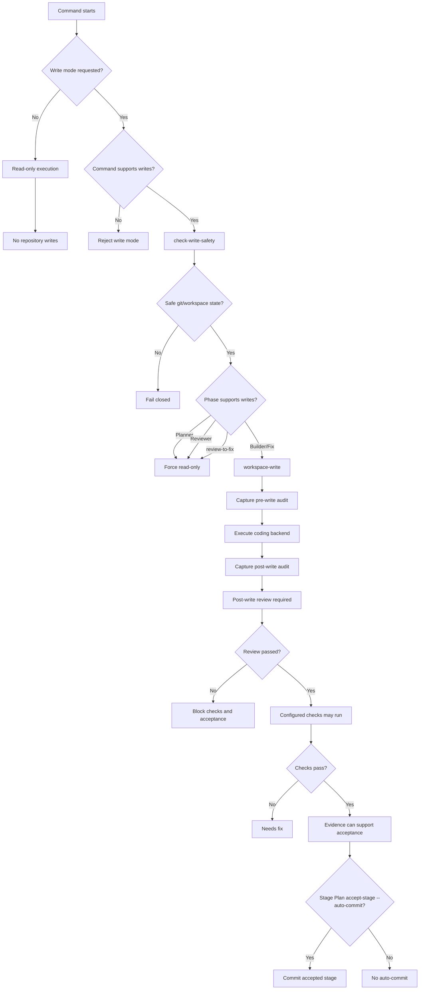

# Write gates flow

This diagram shows how MergeWright keeps write execution explicit, gated, and auditable.

Related docs:

- `docs/safety/write-safety.md`
- `docs/safety/write-mode.md`
- `docs/architecture/flows.md`
