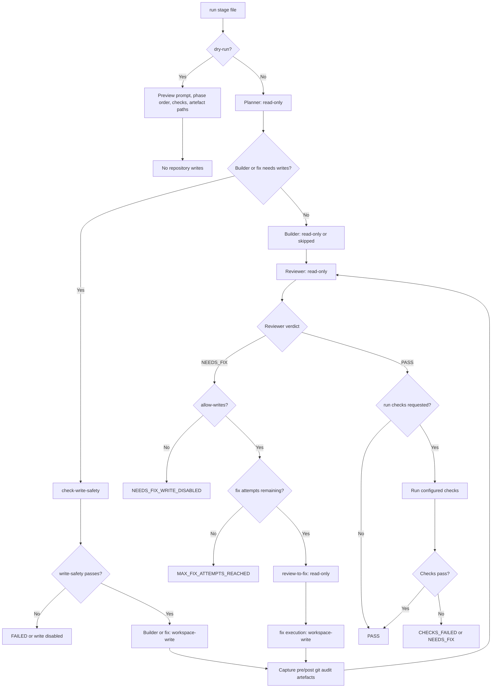

# Classic run flow

This diagram shows how a classic `run` or `continue-run` moves through planning, implementation, review, bounded fixes, and checks.

Related docs:

- `docs/workflows/classic-run.md`
- `docs/architecture/flows.md`
- `docs/safety/write-mode.md`
