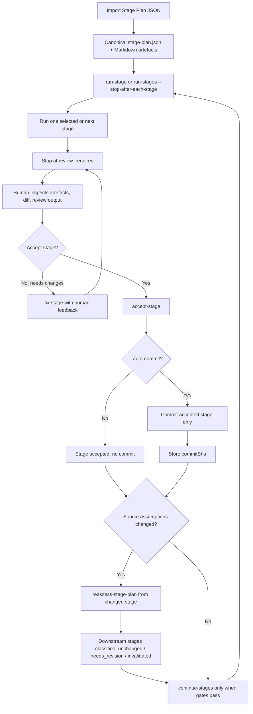

# Stage Plan flow

This diagram shows the human-gated multi-stage delivery path for Stage Plans.

Related docs:

- `docs/workflows/stage-plan.md`
- `docs/architecture/flows.md`
- `docs/safety/write-mode.md`
